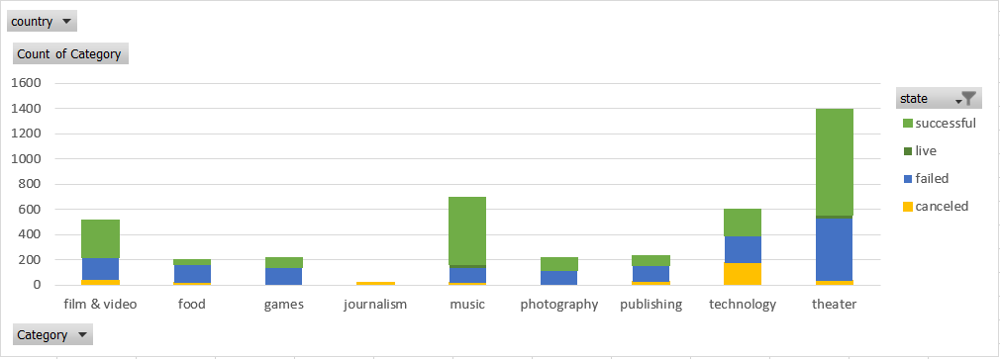

# Project-Funding-Analysis-with-MSExcel
Over $2 billion has been raised using the crowdfunding service, Kickstarter, but not every project has found success. Of the more than 300,000 projects launched on Kickstarter, only a third have made it through the funding process with a positive outcome.

Getting funded on Kickstarter requires meeting or exceeding the project's initial goal, so many organizations spend months looking through past projects in an attempt to discover some trick for finding success. The project is to analyze a database of 4,000 past projects in order to uncover any hidden trends.

## Tools and technologies used and required to run the project
MS Excel

## How to Run the Code
Open the Excel file. Read through each worksheet to view data in tables and graphs. Also, check out the word file for conclusions drawn from the analysis, limitations of the dataset and alternative presentations.

## Output

Broad Category wise Classification for each Category
Monthly

Sub Category wise Classification for each Category

Monthly Classification

Funding Based Classification

Basic Stats

Conditional Formatting

